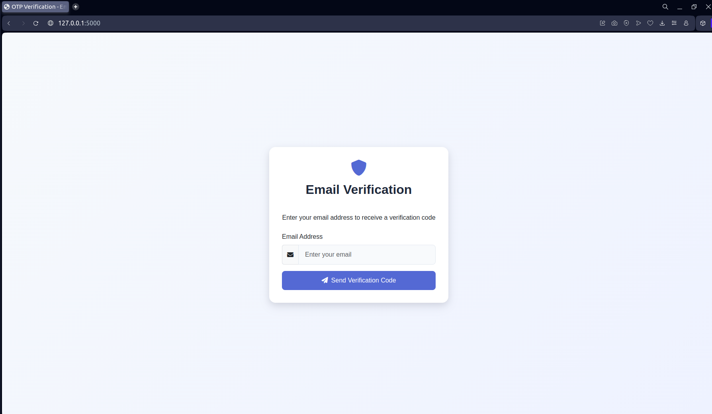
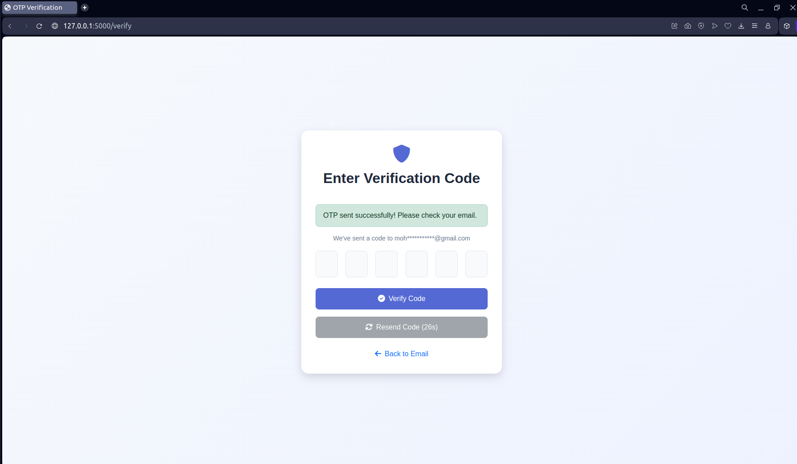

# 🔐 OTP Email Verification with Flask

This project is a simple Flask application that allows users to verify their email using a 6-digit OTP sent via email. It includes features like OTP expiry, resend cooldown, attempt tracking, and session-based data handling.

---

## 🚀 Features

- Send OTP to user email
- 6-digit OTP generation
- OTP expiration handling
- Cooldown between resending OTPs (per user)
- Limits on incorrect OTP attempts
- Flash messages for user feedback

---

## 📦 Project Structure

```
otp-email-verification/
├── app/
│   ├── __init__.py
│   ├── config.py
│   ├── routes/
│   │   └── main.py
│   ├── services/
│   │   └── email_service.py
│   ├── utils/
│   │   └── otp_utils.py
│   └── templates/
│       ├── index.html
│       ├── verify.html
│       └── success.html
├── .env
├── .env.example
├── .gitignore
├── run.py
└── venv/
```

---

## ⚙️ Setup Instructions

### 1. Clone the Repository

```bash
git clone https://github.com/rinas21/otp-email-verification
cd otp-email-verification
```

### 2. Create Virtual Environment

```bash
python3 -m venv venv
source venv/bin/activate
```

### 3. Install Dependencies

```bash
pip install -r requirements.txt
```
If `requirements.txt` doesn’t exist, generate it:

```bash
pip freeze > requirements.txt
```

### 4. Configure `.env`

Copy `.env.example` to `.env` and update it with your email credentials:

```bash
cp .env.example .env
```

Set values like:

```env
MAIL_SERVER=smtp.gmail.com
MAIL_PORT=587
MAIL_USE_TLS=True
MAIL_USERNAME=your_email@example.com
MAIL_PASSWORD=your_app_password
```

### 5. Run the Application

```bash
python run.py
```

Visit: [http://localhost:5000](http://localhost:5000)

---
## 🖼️ Screenshot

Here is how the OTP verification page looks:





## 🧪 Testing Features

- Enter an email to receive an OTP
- Enter the OTP to verify
- OTP expires after X seconds (configurable)
- Can only resend OTP after cooldown period (per email)
- Max 3 attempts to enter the correct OTP

---

## 🛡️ Security Notes

- Uses session for storing OTP and user metadata
- Ensure you’re using App Passwords if using Gmail (do not store raw passwords)

---

## 📄 License

This project is open source and free to use under the MIT License.